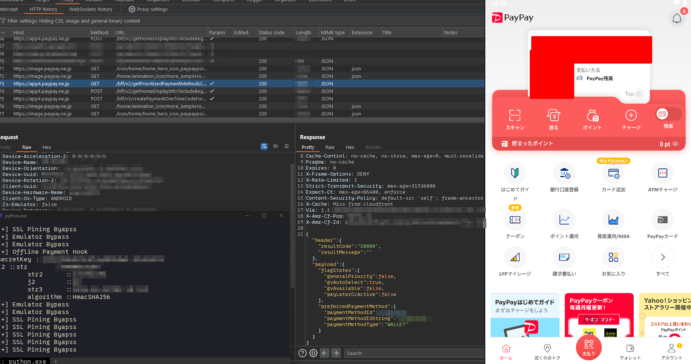

# PayPay Frida Scripts

PayPayアプリの解析を楽に行う為のFrida Script

# 機能

- SSL Pining Bypass
- エミュレーター検知回避
- v1/config等に必要な**Hash**のhook
- オフライン支払いの関数hook

# 使い方

```bash
frida -U -l index.js -f jp.ne.paypay.android.app
```


# 注意

PayPay 4.40.1~4.41.1でのみ動作確認済み

# 連絡先

- Matrix: @qoo.nyan:usesarchbtw.lol
